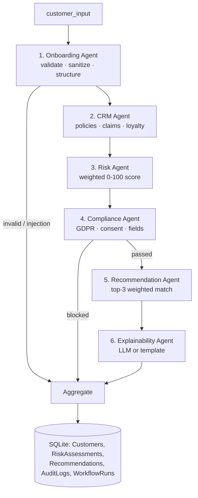

# Architecture

## System Diagram

```
┌──────────────────────────────────┐       ┌──────────────────────────────────────┐
│   FRONTEND  (Next.js :3000)      │       │   BACKEND  (FastAPI :8000)           │
│                                  │       │                                      │
│  7-Step Onboarding Wizard        │       │  ┌────────────────────────────────┐  │
│  Result Dashboard                │ HTTP  │  │  SUPERVISOR AGENT (LangGraph)  │  │
│  Risk Gauge (animated SVG)       │──────▶│  │  routing · retry ×3 · fallback │  │
│  Agent Timeline & Trace          │  JWT  │  └───────────────┬────────────────┘  │
│  AI Chat Assistant (guardrails)  │       │                  │                   │
│  NextAuth (credentials + JWT)    │       │   1 Onboarding ──▶ 2 CRM ──▶ 3 Risk  │
│  Zustand (progress auto-save)    │       │        └── gate ──▶ 4 Compliance     │
└──────────────────────────────────┘       │             │ pass                   │
                                           │             ▼                        │
        TCS GenAI Lab LLM (optional)       │   5 Recommendation ──▶ 6 Explain     │
        https://genailab.tcs.in  ◀─────────│──  PII-masked prompts   │            │
                                           │                         ▼            │
        Mock CRM (synthetic JSON)  ◀───────│── /crm/*     7 Aggregate ──▶ SQLite  │
                                           └──────────────────────────────────────┘
```

## Agent Graph (LangGraph)



## Supervisor Responsibilities

1. **Orchestration** — linear pipeline with conditional gates (input errors, compliance blocks)
2. **Retry handling** — up to 3 attempts per agent with error classification
   (`input_error` → fail fast; `transient`/`recoverable` → retry then fallback)
3. **Fallbacks** — deterministic responses keep the workflow alive (e.g., age-only
   risk estimate, budget-sorted catalog picks, empty-CRM degraded mode)
4. **Aggregation** — final summary for the dashboard incl. trace, agent statuses,
   recovered errors, compliance report
5. **Observability** — structured logs + AuditLogs persistence

## Data Model (SQLite)

- `users` — demo credentials
- `customers` — onboarded profiles (upsert by email)
- `policies` — 8-product catalog
- `risk_assessments` — score, category, confidence, factor breakdown
- `recommendations` — top-3 per run with reasoning
- `audit_logs` — per-agent events (status, latency, attempts)
- `workflow_runs` — full final state per run

## LLM Integration (TCS GenAI Lab)

`backend/app/services/llm.py` builds a single `ChatOpenAI` client pointed at
`https://genailab.tcs.in` (OpenAI-compatible). The model is configured in
`.env` (`LLM_MODEL`, e.g. `genailab-maas-gpt-4o`), with automatic model
discovery against `/v1/models` so the best available model for the key is
picked even if the configured name differs. All prompts are PII-masked before
they leave the process. Failures fall back to deterministic templates, so the
platform is fully functional without a key.
